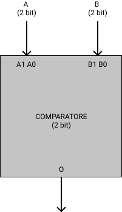
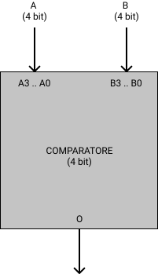
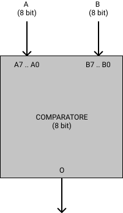
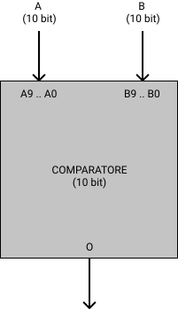
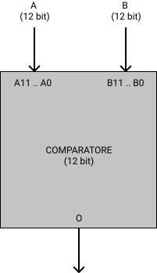
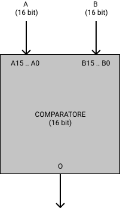

# COMPARATORI

Questa cartella contiene i comparatori.

I comparatori si occupano di verificare se il primo dato
in ingresso e' uguale al secondo.

Se i dati sono uguali l'uscita e' a livello logico alto (1),
altrimenti e' a livello logico basso (0).

## Requisiti
Tutti i comparatori dipendono dalla porta logica xnor.

La porta logica xnor dipende a sua volta dalla porta xor
e dalla porta not.

E' possibile eseguire lo script ```setup.sh```
nella cartella ```tests``` per copiare automaticamente
le dipendenze in questa cartella.

> Se si tenta di simulare un comparatore senza
> avere nella cartella le dipendenze necessarie
> SIS dara' un errore relativo a ```.search```
> perche' non e' riuscito a trovare il file con la dipendenza

## COMPARATORE 2



```comparatore2.blif``` si occupa di confrontare
due numeri rappresentati con 2 bit ciascuno.

Il componente e' composto di porte xnor
che si occupano di verificare se i singoli bit
sono uguali.

Il risultato di ogni xnor e' posto in and:
se tutti i bit sono uguali i due ingressi
sono uguali e l'uscita del comparatore e' 1.


## COMPARATORE 4



```comparatore4.blif``` si occupa di confrontare
due numeri rappresentati con 4 bit ciascuno.

Il componente e' composto di porte xnor
che si occupano di verificare se i singoli bit
sono uguali.

Il risultato di ogni xnor e' posto in and:
se tutti i bit sono uguali i due ingressi
sono uguali e l'uscita del comparatore e' 1.


## COMPARATORE 8



```comparatore8.blif``` si occupa di confrontare
due numeri rappresentati con 8 bit ciascuno.

Il componente e' composto di porte xnor
che si occupano di verificare se i singoli bit
sono uguali.

Il risultato di ogni xnor e' posto in and:
se tutti i bit sono uguali i due ingressi
sono uguali e l'uscita del comparatore e' 1.

## COMPARATORE 10



```comparatore10.blif``` si occupa di confrontare
due numeri rappresentati con 10 bit ciascuno.

Il componente e' composto di porte xnor
che si occupano di verificare se i singoli bit
sono uguali.

Il risultato di ogni xnor e' posto in and:
se tutti i bit sono uguali i due ingressi
sono uguali e l'uscita del comparatore e' 1.

## COMPARATORE 12



```comparatore12.blif``` si occupa di confrontare
due numeri rappresentati con 12 bit ciascuno.

Il componente e' composto di porte xnor
che si occupano di verificare se i singoli bit
sono uguali.

Il risultato di ogni xnor e' posto in and:
se tutti i bit sono uguali i due ingressi
sono uguali e l'uscita del comparatore e' 1.

## COMPARATORE 16



```comparatore16.blif``` si occupa di confrontare
due numeri rappresentati con 16 bit ciascuno.

Il componente e' composto di porte xnor
che si occupano di verificare se i singoli bit
sono uguali.

Il risultato di ogni xnor e' posto in and:
se tutti i bit sono uguali i due ingressi
sono uguali e l'uscita del comparatore e' 1.