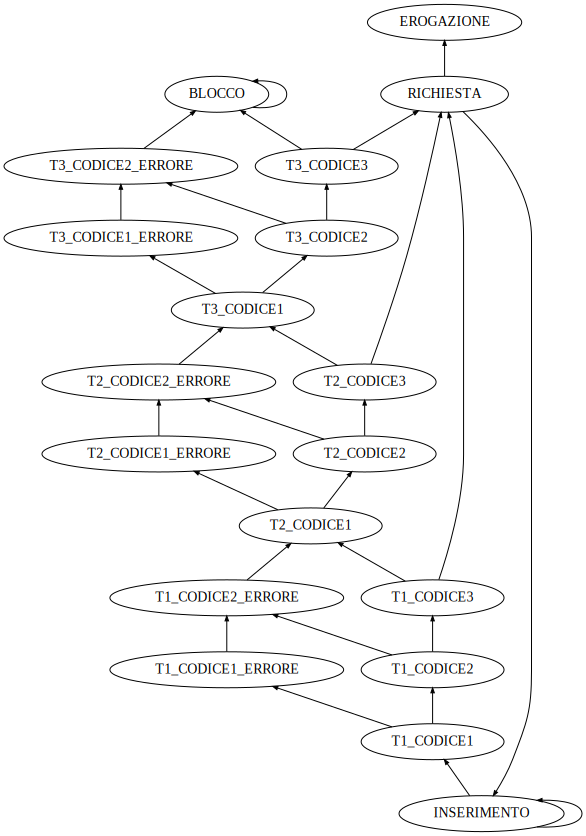

# FSM

Questa cartella contiene la macchina a stati finiti
per l'elaborato di architettura degli elaboratori.

Tabella degli stati della fsm ottimizzata:

|nome abbreviato|nome completo     |codifica|
|---------------|------------------|--------|
|S0             |T3_CODICE2_ERRORE |11000   |
|S1             |INSERIMENTO       |00010   |
|S2             |T1_CODICE1        |00110   |
|S3             |T1_CODICE1_ERRORE |01011   |
|S4             |T1_CODICE2        |01111   |
|S5             |T1_CODICE2_ERRORE |00001   |
|S6             |T1_CODICE3        |00101   |
|S7             |T2_CODICE1        |11101   |
|S8             |RICHIESTA         |11001   |
|S9             |T2_CODICE1_ERRORE |10000   |
|S10            |T2_CODICE2        |10100   |
|S11            |T2_CODICE2_ERRORE |01000   |
|S12            |T2_CODICE3        |01100   |
|S13            |T3_CODICE1        |11011   |
|S14            |T3_CODICE1_ERRORE |01001   |
|S15            |T3_CODICE2        |01101   |
|S16            |T3_CODICE3        |11100   |
|S17            |EROGAZIONE        |10001   |