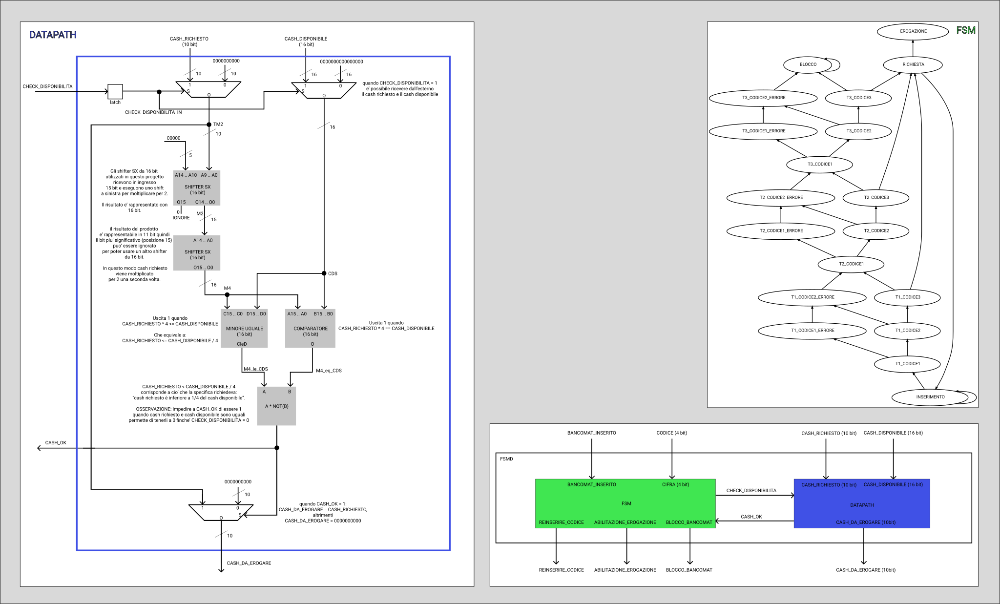

# FSMD

Questa cartella contiene la FSMD dell'elaborato di architettura degli elaboratori.


Dove la fsm e' contenuta nella cartella [```fsm```](../fsm) e il datapath e' contenuto nella cartella [```datapath```](../datapath).

> Tra la fsm e il datapath e' stato inserito un latch per evitare l'errore
> ```"error: network contains a cycle"```


> Immagine della fsm creata dal programma ```generate-stg``` [scaricabile da qui](https://github.com/bohzio/sis-tools),
> modificato per salvare il grafico come documento svg (il programma esporta in png)

## Requisiti

Per simulare la FSMD e' necessario copiare la fsm ottimizzata e il datapath (con tutte le sue dipendenze) in questa directory.

Per fare questo eseguire lo script ```setup.sh``` contenuto nella cartella ```tests```.