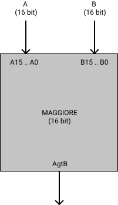

# MAGGIORE

Questa cartella contiene i file blif
che descrivono circuiti che si occupano
di confrontare due numeri in ingresso e dire
se il primo numero e' maggiore del secondo.

I circuiti confrontano i bit degli ingressi
con la porta logica xor:
se due bit sono diversi il numero che
contiene il bit che vale 1 e' maggiore di quello che contiene il bit a 0

Esempio:

    A = 10110 (= 22)
    B = 11000 (= 24)

* Il primo bit di A e B sono uguali, li ignoro
* Il secondo bit di A e B sono diversi: il numero
che contiene il bit a 1 e' il numero piu' grande.
B e' piu' grande di A.

Confrontare gli altri bit non ha senso:
appena trovo due bit diversi so quale numero e'
il numero piu' grande.

## Requisiti
Questi circuiti richiedono la porta logica xor
per funzionare.

E' possibile eseguire lo script ```setup.sh```
dentro alla cartella ```tests``` che si occupera'
di copiare automaticamente la porta xor in questa cartella.

## MAGGIORE 6

<div style="background-color: white; padding:20px;display:inline-block;">


</div>

```maggiore6.blif``` si occupa di confrontare
due numeri rappresentati con 6 bit ciascuno.

## MAGGIORE 16

<div style="background-color: white; padding:20px;display:inline-block;">


</div>

```maggiore16.blif``` si occupa di confrontare
due numeri rappresentati con 16 bit ciascuno.