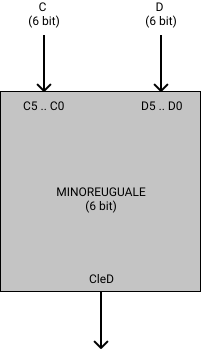
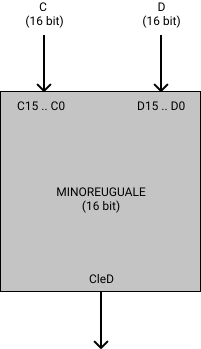

# MINOREUGUALE

Questa cartella contiene i file blif
che descrivono circuiti che si occupano
di confrontare due numeri in ingresso e dire
se il primo numero e' minore uguale del secondo.

## Requisiti
Questi circuiti richiedono il complementare (maggiore)
per poter funzionare.
> Ad esempio ```minoreuguale6.blif``` richiede ```maggiore6.blif```

I circuiti per identificare il numero maggiore
richiedono invece la porta logica xor.

E' possibile eseguire lo script ```setup.sh```
nella cartella ```tests``` per copiare
automaticamente i file necessari.

## MINORE UGUALE 6

<div style="background-color: white; padding:20px;display:inline-block;">


</div>

```minoreuguale6.blif``` si occupa di confrontare
due numeri rappresentati con 6 bit ciascuno.

## MINORE UGUALE 16

<div style="background-color: white; padding:20px;display:inline-block;">


</div>

```minoreuguale16.blif``` si occupa di confrontare
due numeri rappresentati con 16 bit ciascuno.