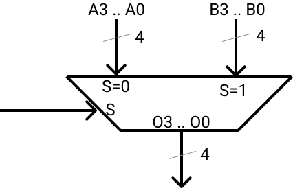

# MULTIPLEXER

Questo readme descrive i multiplexer presenti in questa cartella.

I multiplexer hanno una nomenclatura precisa:

    mux<n_ingressi>i<n_bit>b.blif

Dove:
* ```<n_ingressi>``` e' il numero di dati in ingresso
* ```<n_bit>``` e' il numero di bit che rappresentano i dati

I nomi degli input sono:
* ```S<n>``` sono i selettori
    > dove ```<n>``` puo' non esserci o essere ```1```, ```0```, ...
    > a seconda di quandi bit di selettore sono necessari
    > (8 ingressi richiedono 3 bit di selettore, quindi gli ingressi sono ```S2```, ```S1``` e ```S0```)
* ```A<x>```, ```B<x>```, ```C<x>```, ... sono i dati in ingresso
    > dove ```<x>``` e' un numero che dipende da quanti bit
    > rappresentano l'ingresso
    > (esempio: per 4 ingressi da due bit gli ingressi sono 
    > ```A1```, ```A0```, ```B1```, ```B0```, ```C1```, ```C0```, ```D1```, ```D0```)

    > Nei multiplexer dove gli ingressi
    > sono rappresentati con un bit solo
    > gli input sono nominati ```I<x>```
    > dove ```<x>``` e' un numero che identifica l'ingresso.
    > (esempio: un multiplexer da 2 ingressi di un bit ciascuno sono ```I1``` e ```I0```)

I nomi degli output sono:
* ```O<x>```
    > dove ```<x>``` e' un numero che dipende da quanti bit
    > rappresentano l'uscita
    > (esempio: se gli ingressi sono rappresentati con due bit le uscite sono 
    > rappresentate con due bit nominati ```O1``` e ```O0```

Esempio:

    mux2i4b.blif

Significa che il multiplexer permette di selezionare due dati
da 4 bit l'uno.

Il test provera' quindi 2**9 combinazioni diverse.
> Dove 9 = 2*4 + 1. 1 e' il bit di selezione e 8 sono i bit complessivi dei dati (4 per dato)

NOTA: i multiplexer con un numero superiore di 2^20 combinazioni non sono testati
con tutte le combinazioni possibili
> ```mux2i10b```, ```mux2i16b```, ```mux4i8b```, ```mux8i4b``` e ```mux8i8b``` non sono testati completamente

## MUX2I1B
<div style="background-color: white; padding:20px;display:inline-block;">


</div>

```mux2i1b.blif``` e' un multiplexer a 2 ingressi
da 1 bit per ingresso.

## MUX2I2B
<div style="background-color: white; padding:20px;display:inline-block;">


</div>

```mux2i2b.blif``` e' un multiplexer a 2 ingressi
da 2 bit per ingresso.

## MUX2I4B
<div style="background-color: white; padding:20px;display:inline-block;">


</div>

```mux2i4b.blif``` e' un multiplexer a 2 ingressi
da 4 bit per ingresso.

## MUX2I8B
<div style="background-color: white; padding:20px;display:inline-block;">


</div>

```mux2i8b.blif``` e' un multiplexer a 2 ingressi
da 8 bit per ingresso.

...