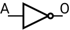
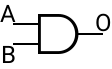
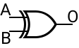
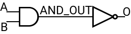
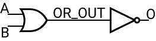
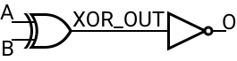

# PORTE_LOGICHE
Questo readme descrive le porte logiche contenute
in questa directory.

> Nella cartella ```tests``` sono contenuti gli script di esecuzione simulazione (```*.script```)
> e i file con gli output attesi (```*_correct_output.txt```)

> Nella cartella ```images``` sono contenute le immagini(/svg) contenute in questo README

Le porte logiche eseguono operazioni logiche.

## NOT



La porta not nega l'ingresso.

|A|O|
|-|-|
|0|1|
|1|0|

La tabella di verita' e' riportata nel file .blif

## AND



La porta and restituisce 1 quando entrambe gli ingressi sono uguali a 1.

|A|B|O|
|-|-|-|
|0|0|0|
|0|1|0|
|1|0|0|
|1|1|1|

La tabella di verita' e' riportata nel file .blif

## OR


La porta or restituisce 1 quando almeno uno degli ingressi e' 1.

|A|B|O|
|-|-|-|
|0|0|0|
|0|1|1|
|1|0|1|
|1|1|1|

La tabella di verita' e' riportata nel file .blif

## XOR



La porta xor restituisce 1 quando i due ingressi sono diversi.

|A|B|O|
|-|-|-|
|0|0|0|
|0|1|1|
|1|0|1|
|1|1|0|

La tabella di verita' e' riportata nel file .blif

## NAND


Complementare della porta and: restituisce 0 quando entrambe gli ingressi sono uguali a 1.

|A|B|O|
|-|-|-|
|0|0|1|
|0|1|1|
|1|0|1|
|1|1|0|

Nel file .blif viene usata una porta [not](#not) per negare l'uscita della porta [and](#and).



## NOR


Complementare della porta or: restituisce 1 quando entrambe gli ingressi sono 0.

|A|B|O|
|-|-|-|
|0|0|1|
|0|1|0|
|1|0|0|
|1|1|0|

Nel file .blif viene usata una porta [not](#not) per negare l'uscita della porta [or](#or).



## XNOR


Complementare della porta xor: restituisce 1 quando entrambe gli ingressi sono uguali.

|A|B|O|
|-|-|-|
|0|0|1|
|0|1|0|
|1|0|0|
|1|1|1|

Nel file .blif viene usata una porta [not](#not) per negare l'uscita della porta [xor](#xor).

